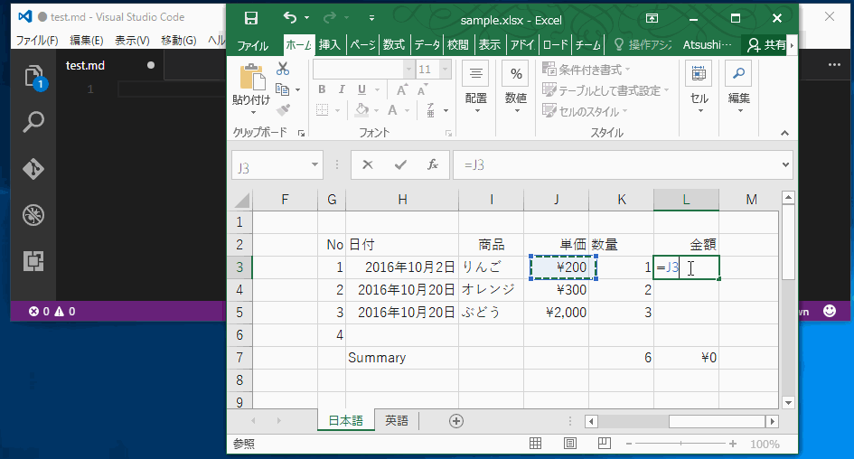

# Copy to Markdown AddIn

選択したExcelのセルをMarkdown形式でコピーするExcelアドインです。  

  

日付の書式、金額、カンマフォーマットなども生かしたままコピーできます。  
右寄せ・左寄はヘッダー行の設定に従います。  
Markdown形式のブログでテーブルを記述する際などにご利用ください。  

### 動作確認済みのOffice＆Windows  

* Windows 7 64bit & Office 2010  
* Windows 10 64bit & Office 2016

### 必要環境  

* .NET Framework 4.5.2以上  
* Visual Studio 2010 Tools for Office Runtimeのインストールが求められるかもしれません  
  
上記モジュールがインストールされていない場合、インストーラーからダウンロードされてインストールされる可能性があります。  

### 操作方法  

貼り付けたい範囲を選択して、右クリックから「Copy to Markdown」を選択して、あとは好きなところに貼り付けましょう！  
それだけです。  

### ダウンロード  

Github上にzip形式でインストーラーを置いてあります。  

1. 以下からダウンロードする  
[https://github.com/nuitsjp/CopyToMarkdownAddIn/releases](https://github.com/nuitsjp/CopyToMarkdownAddIn/releases)
2. <b>zipファイル右クリックしてプロパティを開き、「ブロックの解除」のチェックをONにする</b>  
3. setup.exeを実行する  

<b>※要注意※  
zipファイルのダウンロード後、展開する前に必ずファイルのプロパティを開き、「ブロックの解除」をチェックした上で「OK」ボタンを押してください。  
</b>

### ライセンス  

個人・商用に関わらず完全に無料でお使いいただけます。  

### お問い合わせ先  

何かありましたら  

* Issue欄  
* Twitter：[@nuits_jp](https://twitter.com/nuits_jp)

いずれかに連絡ください。  
