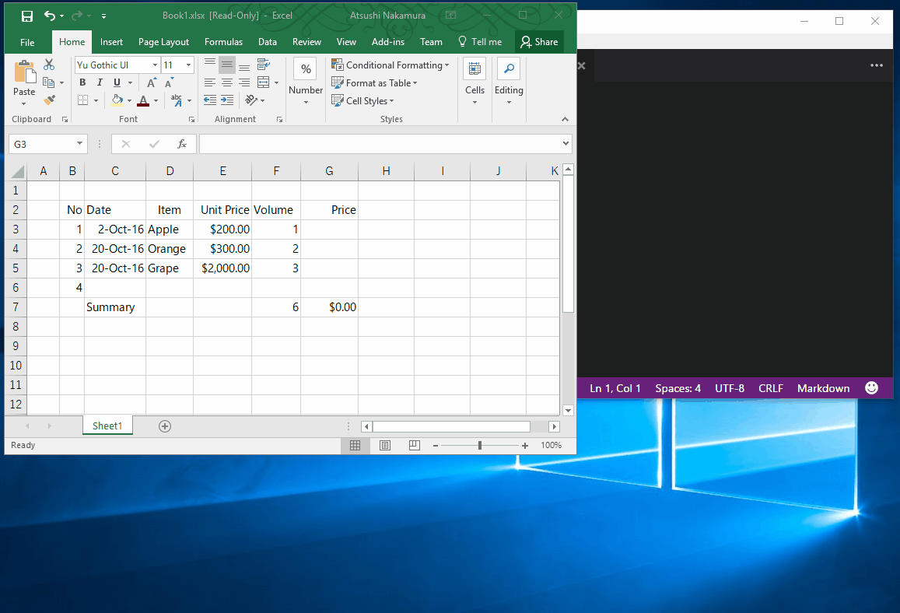

# Copy to Markdown AddIn

Copy from Excel to Markdown, is AddIn for Excel

  

Date format, amount, comma format, etc.. All you can directly copy!    
Horizontal alignment is the same as the beginning of the line.  

### Tested Platform  

* Windows 7 64bit & Office 2010  
* Windows 10 64bit & Office 2016

### Requirements  

* .NET Framework 4.5.2以上  
* Visual Studio 2010 Tools for Office Runtime

If it is not installed, it will be downloaded and installed from the installer.  

### How to use  

1. Select a range in Excel. 
2. Right click. 
3. Select "Copy to Markdown". 
4. Paste to a favorite place!

### Downloaded  

Github上にzip形式でインストーラーを置いてあります。  
以下からダウンロードして回答し、setup.exeを実行してインストールしてください。  

[https://github.com/nuitsjp/CopyToMarkdownAddIn/releases:embed:cite]

何かありましたら、ここにコメントか、Twitterにでも連絡ください。  
それではまた！  
